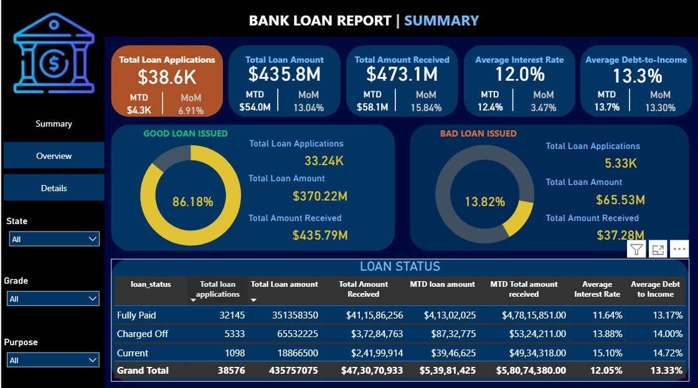
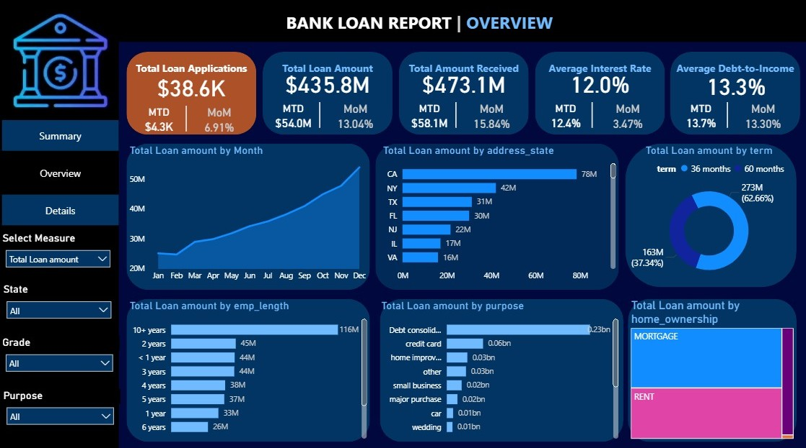
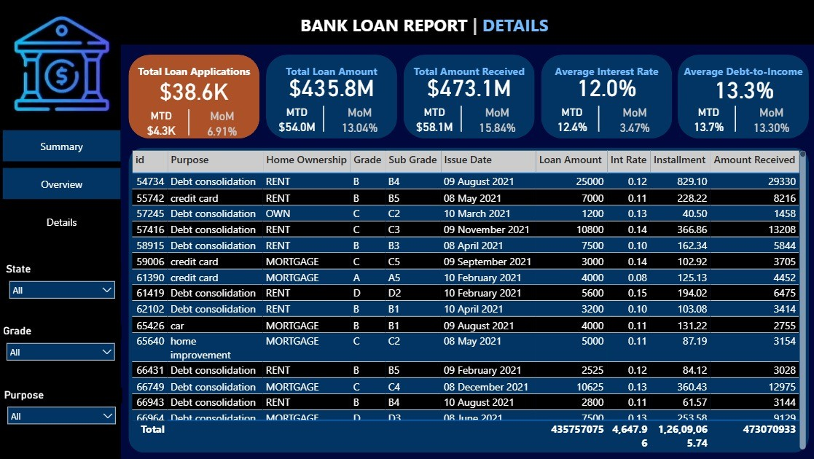

# 📊 Power BI Project: Bank Loan Report  

## 📌 Project Overview  
This project analyzes **Bank Loan performance** across applications, amounts, repayment status, and borrower attributes. The dashboards provide interactive insights into KPIs (applications, sanctioned amounts, collections), **good vs bad loans**, and trends over time—helping lenders improve risk management and decision-making.  

The dataset is visualized in **Power BI** to generate meaningful reports and dashboards with filtering and drill-down capabilities.  

---

## 🚀 Key Features  
- **Executive KPI Summary**  
  - Total Applications, Total Loan Amount, Total Amount Received, Avg. Interest Rate, Avg. Debt-to-Income.  

- **Loan Quality Segmentation**  
  - Split of **Good Loans** (e.g., Fully Paid/Current) vs **Bad Loans** (e.g., Charged Off) with percentages.  

- **Loan Status Distribution**  
  - Breakdown of **Fully Paid, Charged Off, Current** with amounts, MTD and MoM indicators.  

- **Trend & Geography Analysis**  
  - Monthly trend of sanctioned amount.  
  - State-wise loan amount (e.g., CA, NY, TX, FL).  

- **Borrower & Product Mix**  
  - Loan amount by **Employment Length**, **Home Ownership**, **Loan Term** (36 vs 60 months).  
  - Purpose segmentation (Debt consolidation, Credit card, Home improvement, etc.).  

- **Detailed Grid View**  
  - Drill-down functionality with filters:  
    - **State**  
    - **Grade / Sub-grade**  
    - **Purpose**  
    - **Term**  

---

## 📂 Project Structure  
- **Dashboards**: Interactive Power BI dashboards (screenshots included in repository).  
- **Detailed View**: Tabular drill-down report with slicers for precise analysis.  
- **Visuals**:  
  - Donut / Pie Charts  
  - Bar Charts  
  - Line Graphs  
  - KPI Cards  
  - Drill-down Table  

---

## 📸 Dashboard Previews  

### 🔹 Summary Dashboard  
  

### 🔹 Overview Dashboard  
  

### 🔹 Detailed Grid View  
  

> 💡 Rename the image files in the repo to match these names or update the paths above.

---

## 🌐 Live Dashboard  

Click below to explore the **interactive live dashboard** hosted on Power BI (replace the link if you publish it):  

[**🔗 View the Bank Loan Dashboard**](#)  

---

## 🛠️ Tools & Technologies  
- **Power BI Desktop** – Report & Dashboard Creation  
- **Power BI Service** – Collaboration & Sharing  
- **Data Modeling** – Relationships, Calculated Columns, DAX Measures  

---

## 🎯 Insights Gained  
- Majority of portfolio classified as **Good Loans** with strong collection performance.  
- **California, New York, and Texas** contribute the largest sanctioned amounts.  
- **36-month** loans are more frequent, while **60-month** loans account for larger total amounts.  
- **Debt consolidation** dominates purpose mix; higher approval for **10+ years** employment length.  
- Avg. **DTI ~13%** and **Interest ~12%** across portfolio in this snapshot.  

---

## 📌 How to Use  
1. Clone this repository.  
2. Open the `.pbix` file in **Power BI Desktop**.  
3. Refresh/Connect to the data source (CSV/SQL).  
4. Use slicers to explore:  
   - **State**  
   - **Grade / Sub-grade**  
   - **Purpose**  
   - **Term**  
5. Navigate between **Summary**, **Overview**, and **Details** tabs for different levels of analysis.  

---

## 🤝 Contribution  
Feel free to fork this repo, raise issues, or submit pull requests to enhance visuals, performance, or data model design.  

---

## 📧 Contact  
👤 **Dasappagari Sai Kiran Reddy**  
📩 Email: [dasappagarisaikiranreddy@gmail.com](mailto:dasappagarisaikiranreddy@gmail.com)
